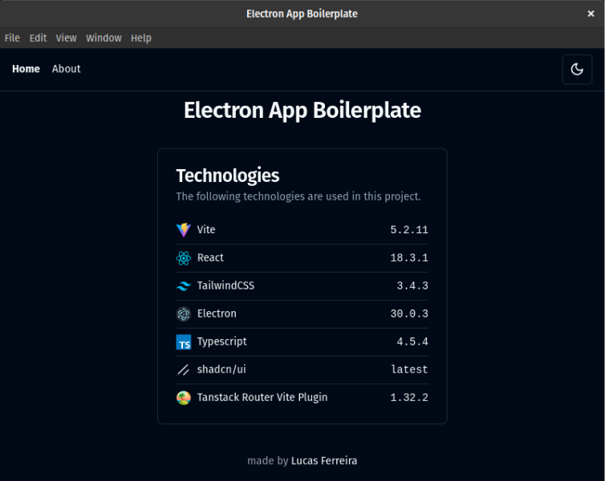
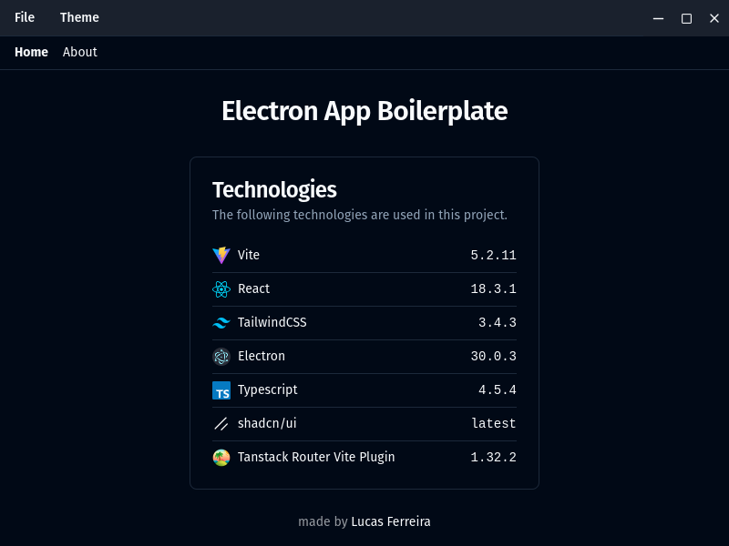

# Electron Boilerplate

## What's included out-of-the-box?

- Electron Forge
- Vite
- React
- TailwindCSS
- shadcn/ui
- Full Typescript support
- Tanstack file-based router

## There are two options

1. With the system title-bar which is the "default".
   

2. With custom title-bar. (branch: `custom-title-bar`)
   

In case you want this second option, you can clone the branch with it:

```bash
git clone -b custom-title-bar https://github.com/luccasfr/electron-boilerplate
```

## How to get started?

1. Install dependencies

```bash
npm install
```

2. Start the project

```bash
npm start
```

## How to create new routes?

Just push new routes into `app` dir and `@tanstack/router-vite-plugin` will do the job, generating the `routeTree.gen.ts` file.
In case of doubts, follow the doc's.

To check **filename conventions**, follow this [link](https://tanstack.com/router/latest/docs/framework/react/guide/file-based-routing#file-naming-conventions).

## Authors

<table>
  <tbody>
    <td align="center">
      <a href="https://github.com/luccasfr">
        
        <p>Lucas Ferreira</p>
      </a>
    </td>
  </tbody>
</table>
